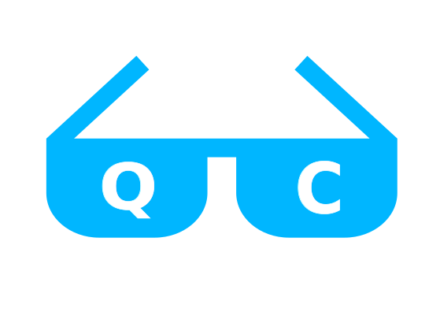

# Awesome-Quantum-Computing   

Quantum Computation and Quantum Information

    <ul style="list-style-type:none">
        

Courses

            <ul style="list-style-type:none">
                

                    
Beginners

                    <ul>
                        <li><a href="http://michaelnielsen.org/blog/quantum-computing-for-the-determined/">Quantum Computing for the Determined</a> by <i>Michael Nielsen</i>: I’ve posted to YouTube a series of 22 short videos giving an introduction to quantum computing. Unfortunatly the series is incomplete.</li>
                        <li><a href="https://www.edx.org/course/quantum-mechanics-everyone-georgetownx-phyx-008-01x">Quantum Mechanics for Everyone</a>: Learn the fundamental notions of quantum mechanics at a level that is accessible to everyone by <a href="https://www.georgetown.edu/">Georgetown University</a>.</li>
                        <li><a href="https://www.edx.org/course/quantum-mechanics-quantum-computation-uc-berkeleyx-cs-191x">Quantum Mechanics and Quantum Computation</a> by <i>V. Umesh</i> at UCBerkley. [<a href="https://www.youtube.com/playlist?list=PL2jykFOD1AWap0r8WOuZ-08BFgMyx-5RT">Youtube</a>] : Unfortunatly the list isn't complete.</li>
                

        

            
Intermediate

            <ul>
                Will be Updated soon!
            </ul>
        

        

            
Advanced

            <ul>
                Will be Updated soon!
            <ul>
        
</ul>
        

        

            
Lecture notes

            <ul style="list-style-type:circle">
                <li><a href="https://cs.uwaterloo.ca/~watrous/TQI/">The Theory of Quantum Information</a> by <i>J. Watrous</i>.</li>
                <li><a href="http://www.theory.caltech.edu/~preskill/ph219/index.html">Quantum Computation</a> by <i>J. Preskill</i>.</li>
                <li><a href="https://homepages.cwi.nl/~rdewolf/qc11.html">Quantum Computing</a> by <i>R. de Wolf</i>.</li>
            </ul style="list-style-type:circle">
            

        

            
Textbook(s)

            <ul style="list-style-type:circle">
                <li> <a href="https://dl.acm.org/citation.cfm?id=1972505">Quantum Computation and Quantum Information: 10th Anniversary Edition</a> by <i>M. Nielsen</i> and <i>I. Chuang</i>. - [<a href="http://csis.pace.edu/ctappert/cs837-18spring/QC-textbook.pdf"> PDF </a>] </li>
            </ul>
            

    </ul>

Quantum Machine Learning

    <ul>
        

Courses

            <ul>
                Will be Updated soon!
            </ul>

        

Lecture notes

            <ul>
                Will be Updated soon!
            </ul>

        

Textbook(s)

            <ul>
                Will be Updated soon!
            </ul>

    </ul>

    
Quantum Cryptography

    <ul>
        

Courses

            <ul>
                Will be Updated soon!
            </ul>

        

Lecture notes

            <ul>
                Will be Updated soon!
            </ul>

        

Textbook(s)

            <ul>
                Will be Updated soon!
            </ul>

    </ul>

    
Blogs

    <ul>
        <li><a href="https://www.scottaaronson.com/blog/">Shtetl-Optimized</a>: Blog by <a href="https://www.scottaaronson.com/">Scott Aaronson</a>.</li>
        <li><a href="https://quantumfrontiers.com/">Quantum Frontiers</a>: A blog by the Institute for Quantum Information and Matter, <i>Caltech</i>.</li>
        <li><a href="http://dabacon.org/qspeak/">Quantum Information Science Announcements</a>: Quantum Information Science Announcements like <i>jobs, conferences, research opportunities, etc</i>. <a href="https://twitter.com/qisannounce">Twitter</a>.</li>
        <li><a href="http://blog.qutech.nl/">Bits of Quantum</a>: A blog by <a href="https://qutech.nl/">QuTech</a> with three levels of difficulties.</li>
        <li><a href="https://quantarei.wordpress.com/">QuantaRei</a>: Blog by the researchers of <a href="https://quantingham.wordpress.com/">Quantum Correlation Group</a> at <a href="http://www.nottingham.ac.uk/">University of Nottingham</a>.</li>
        <li><a href="http://dabacon.org/pontiff/">The Quantum Pontiff</a>: Blog about the wondrous quantum world in which we live. </li>
        <li>A <a href="https://uwaterloo.ca/institute-for-quantum-computing/blog/post/welcome-our-new-blog">Blog</a> by the <a href="https://uwaterloo.ca/institute-for-quantum-computing/">Institute for Quantum Computing</a> at <a href="https://uwaterloo.ca/">University of Waterloo</a>.</li>
        <li>A <a href="https://terrytao.wordpress.com/">Blog</a> by Terence Tao, on his research and expository papers, discussion of open problems, and other maths-related topics.</li>
        <li>A <a href="https://quantum-journal.org/blog#">Blog</a> by the open-journal, <a href="https://quantum-journal.org">Quantum</a>: "Quantum is an open-access peer-reviewed journal for quantum science and related fields".</li>
    </ul>

    
Wikis

    <ul>
        Will be Updated soon!
    </ul>

    
Papers

    <ul>
        <li><strong>Title</strong>:<a href="https://arxiv.org/pdf/0910.3376.pdf"> Quantum Proofs for Classical Theorems</a>. <strong>Abstract</strong>: Alongside the development of quantum algorithms and quantum complexity theory in recent years, quantum techniques have also proved instrumental in obtaining results in diverse classical (non-quantum) areas, such as coding theory, communication complexity, and polynomial approximations. In this paper we survey these results and the quantum toolbox they use.</li>
        <li><strong>Title</strong>: <a href="https://www.scottaaronson.com/papers/qml.pdf">Quantum Machine Learning Algorithms: Read the Fine Print</a></li>
        <li><strong>Title</strong>: <a href="https://www.nature.com/articles/nature23474">Quantum Machine Learning</a> <a href="https://arxiv.org/abs/1611.09347">[ArXiv]</a> <strong>Thesis</strong>: Fuelled by increasing computer power and algorithmic advances, machine learning techniques have become powerful tools for finding patterns in data. Quantum systems produce atypical patterns that classical systems are thought not to produce efficiently, so it is reasonable to postulate that quantum computers may outperform classical computers on machine learning tasks. The field of quantum machine learning explores how to devise and implement quantum software that could enable machine learning that is faster than that of classical computers. Recent work has produced quantum algorithms that could act as the building blocks of machine learning programs, but the hardware and software challenges are still considerable. </li>
        <li><strong>Title</strong>: <a href="https://www.nature.com/articles/npjqi201523">Quantum algorithms: an overview</a> <strong>Abstract</strong>: Quantum computers are designed to outperform standard computers by running quantum algorithms. Areas in which quantum algorithms can be applied include cryptography, search and optimisation, simulation of quantum systems and solving large systems of linear equations. Here we briefly survey some known quantum algorithms, with an emphasis on a broad overview of their applications rather than their technical details. We include a discussion of recent developments and near-term applications of quantum algorithms.</li>
        <li><strong>Title</strong>: <a href="https://arxiv.org/abs/1811.02266">An Artificial Neuron Implemented on an Actual Quantum Processor</a> <strong>Thesis</strong>: Artificial neural networks are the heart of machine learning algorithms and artificial intelligence protocols. Historically, the simplest implementation of an artificial neuron traces back to the classical Rosenblatt's `perceptron', but its long term practical applications may be hindered by the fast scaling up of computational complexity, especially relevant for the training of multilayered perceptron networks. Here we introduce a quantum information-based algorithm implementing the quantum computer version of a perceptron, which shows exponential advantage in encoding resources over alternative realizations. We experimentally test a few qubits version of this model on an actual small-scale quantum processor, which gives remarkably good answers against the expected results. We show that this quantum model of a perceptron can be used as an elementary nonlinear classifier of simple patterns, as a first step towards practical training of artificial quantum neural networks to be efficiently implemented on near-term quantum processing hardware.</li>
        <li><strong>Title</strong>: </li>
    </ul>

    
Miscellaneous

    <ul>
        Will be Updated soon!
    </ul>

    
Conferences

    <ul>
        Will be Updated soon!
    </ul>

    
People to follow

    <ul>
        Will be Updated soon!
    </ul>

    
Sources

    <ul>
        <li><a href="https://www.cs.umd.edu/class/spring2018/cmsc457/reference.html">References</a> of <a href="https://www.cs.umd.edu/class/spring2018/cmsc457/index.html">CMSC/PHYS 457</a> by <a href="https://www.cs.umd.edu/~xwu/">Xiaodi Wu</a>.</li>
    </ul>

